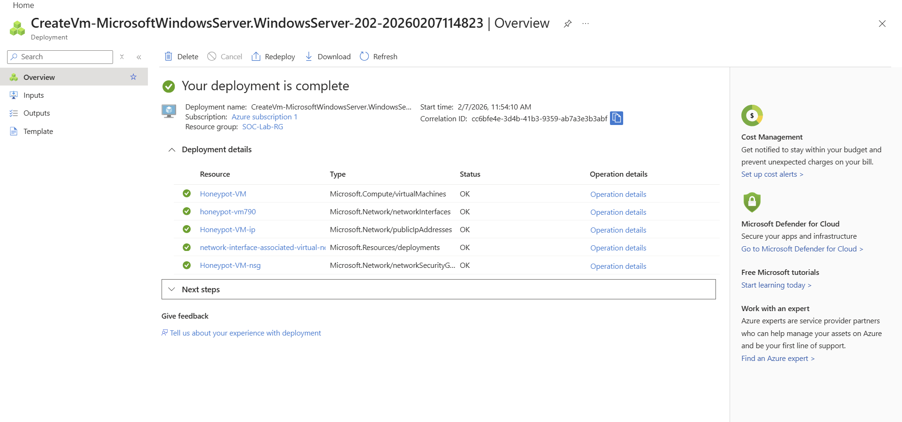
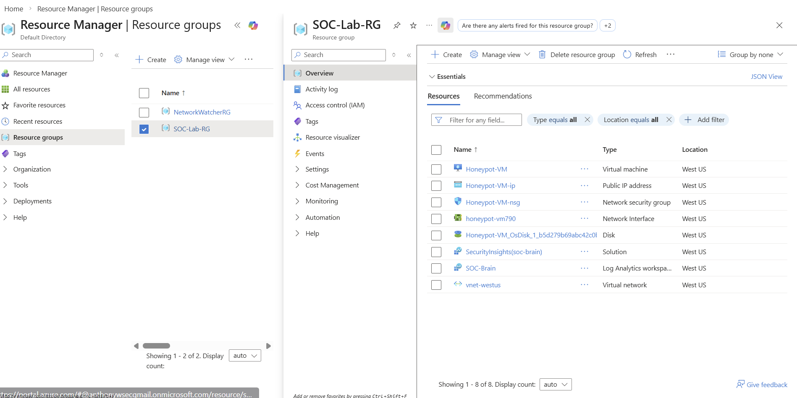
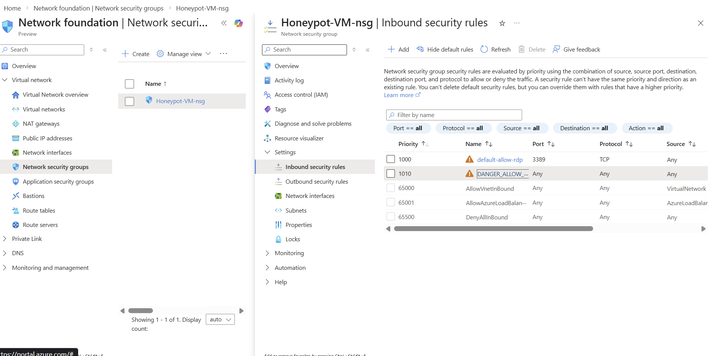
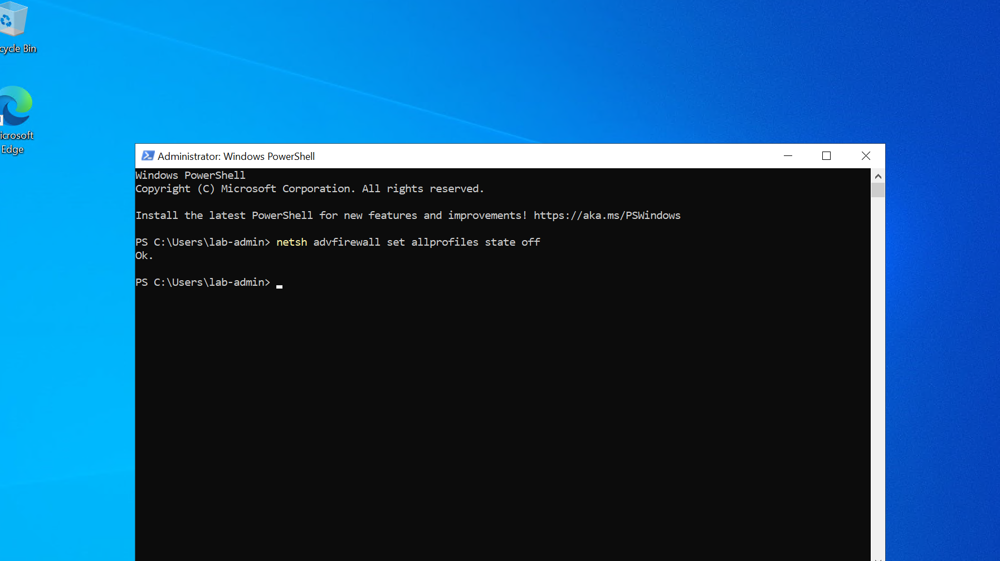
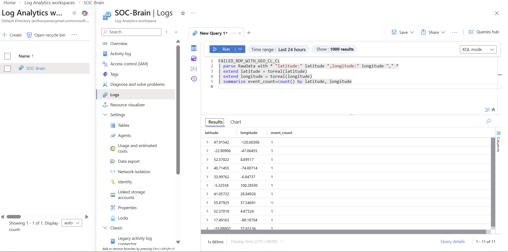
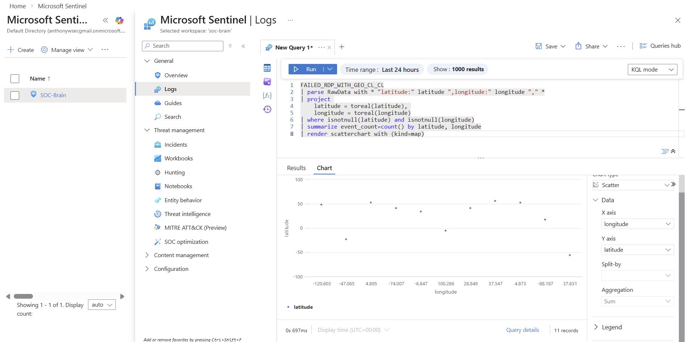

# 🌐 Azure Sentinel SIEM & Live Threat Intelligence Map

## 📝 Project Overview
In this project, I established a **Cloud-Native SIEM (Microsoft Sentinel)** environment to monitor global RDP brute-force attacks in real-time. I deployed a vulnerable "HoneyPot" VM in Azure, intentionally exposed it to the public internet, and built a custom data pipeline to geolocate attackers on a live geospatial dashboard.

### 🛠 Tech Stack
* **SIEM/SOAR**: Microsoft Sentinel
* **Log Management**: Azure Log Analytics Workspace (`soc-brain`)
* **Virtualization**: Windows Server 2022 (HoneyPot-VM)
* **Automation**: PowerShell ISE
* **Data Analysis**: Kusto Query Language (KQL)
* **Geolocation API**: ipgeolocation.io

---

## 🏗️ Architecture & Deployment

### **1. Cloud Infrastructure Setup**
I provisioned a dedicated Resource Group (`SOC-Lab-RG`) to house the Honeypot VM and the associated networking components. 




### **2. Exposure Strategy**
To attract global botnet traffic, I implemented an aggressive Network Security Group (NSG) rule (`DANGER_ALLOW_ANY_INBOUND`) that opened all inbound ports. Inside the VM, I disabled all local firewall profiles to ensure every connection attempt reached the security logs.




---

## 🛡️ Critical Troubleshooting (The "Battle Scars")

This lab served as a rigorous exercise in infrastructure debugging:

* **Heartbeat Verification**: I verified the connection between my local VM agent and the cloud workspace to ensure 100% data ingestion uptime.
* **Permission Hardening**: I bypassed system directory restrictions by migrating the log pipeline to the root `C:\` drive to ensure the **Microsoft Monitoring Agent** had full write access.
* **UI Visualization Constraints**: I overcame a SIEM interface bug by utilizing the `render scatterchart` command in KQL to force a geospatial visualization.

---

## 📊 Data Analysis & Final Visualization

I successfully captured and parsed **11 distinct global attack vectors** within a single session.

### **KQL Analysis Query**
```kusto
// Custom query to parse raw logs and render geospatial dots
FAILED_RDP_WITH_GEO_CL_CL
| parse RawData with * "latitude:" latitude ",longitude:" longitude "," *
| project 
    latitude = toreal(latitude), 
    longitude = toreal(longitude)
| where isnotnull(latitude) and isnotnull(longitude)
| summarize event_count=count() by latitude, longitude
| render scatterchart with (kind=map)
```
---

Geospatial Mapping
The final output demonstrates the geographic distribution of attacks, with coordinates successfully plotted on a geospatial grid.

 

🏁 Conclusion
As a 32-year-old student at Chaffey College, this "trial by fire" session solidified my understanding of the Log Pipeline, from raw Windows Events to cloud-based SIEM visualizations. This project proves my ability to not only deploy security tools but to debug the underlying architecture when automated systems fail.
